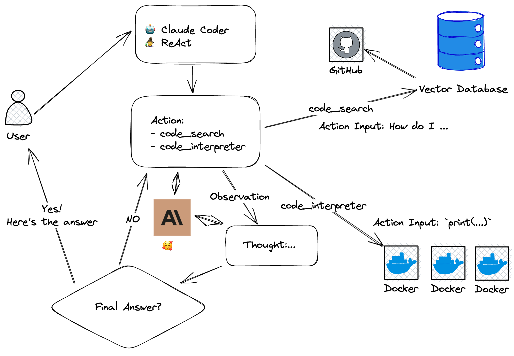

# Claude Coder

> Learn by reading, memorizing and executing the code to see what it does.


## Demo

How does it differ to the raw Claude2?


In the following example, the agent is able to retrive the code snippet from the repo, synthesize a code example and run it in the interpreter.
It first realizes it was missing the document ids when calling add(), it then fixes the code and runs it again to observe the correct result.

<details>
<summary>How do I use similarity seach with chromadb? Can you run an example to show me the result?</summary>

> Entering new AgentExecutor chain...

Here is how I would approach this question step-by-step:

**Thought**: To answer how to use similarity search in ChromaDB, I should first look up the documentation.

**Action**: code_search

**Action Input**: how to do similarity search in chromadb python

**Observation**:  Here is how to do similarity search in Chroma using Python:

First, create a Chroma client and collection:

```python
import chromadb

client = chromadb.Client()

collection = client.create_collection("my_documents")
```

Next, add some documents with embeddings to the collection:

```python
embeddings = [[0.1, 0.2, 0.3], [0.4, 0.5, 0.6]]
documents = ["Document 1", "Document 2"]

collection.add(documents=documents, embeddings=embeddings)
```

To search by similarity, use the `query` method and pass in the query embedding:

```python
query_embedding = [0.2, 0.3, 0.4]

results = collection.query(query_embeddings=[query_embedding], n_results=2)
```

This will return the 2 most similar results to the query embedding.

The `results` will contain the document texts, ids, scores, and other metadata.

So in summary:

1. Create client and collection
2. Add documents with embeddings
3. Query by passing query embedding to `collection.query()`

Let me know if you have any other questions!

**Thought**: Here is an example of using similarity search in ChromaDB with Python:

**Action**: code_interpreter

**Action Input**:
```python
import chromadb

client = chromadb.Client()

collection = client.create_collection("my_documents")

embeddings = [[0.1, 0.2, 0.3], [0.4, 0.5, 0.6]]
documents = ["Document 1", "Document 2"]

collection.add(documents=documents, embeddings=embeddings)

query_embedding = [0.2, 0.3, 0.4]

results = collection.query(query_embeddings=[query_embedding], n_results=2)

print(results)
```

**Observation**:
```
Traceback (most recent call last):
  File "<stdin>", line 10, in <module>
TypeError: Collection.add() missing 1 required positional argument: 'ids'
```

**Thought**: My example code had an error because **I was missing the document ids when calling add()**. Here is the fixed code:

**Action**: code_interpreter

**Action Input**:
```python
import chromadb

client = chromadb.Client()

collection = client.create_collection("my_documents")

embeddings = [[0.1, 0.2, 0.3], [0.4, 0.5, 0.6]]
documents = ["Document 1", "Document 2"]
ids = ["doc1", "doc2"]

collection.add(documents=documents, ids=ids, embeddings=embeddings)

query_embedding = [0.2, 0.3, 0.4]

results = collection.query(query_embeddings=[query_embedding], n_results=2)

print(results)
```

**Observation**:
```
{'ids': [['doc1', 'doc2']], 'distances': [[0.030000001192092896, 0.12000000476837158]], 'metadatas': [[None, None]], 'embeddings': None, 'documents': [['Document 1', 'Document 2']]}
```

**Thought**: The example code successfully runs similarity search on a ChromaDB collection. It adds two documents with embeddings, then queries using a new embedding to find the most similar documents. The print output shows the query returned the expected documents, along with distances and other metadata.

**Final Answer**: Here is an example of using similarity search in ChromaDB with Python:

```python
import chromadb

client = chromadb.Client()

collection = client.create_collection("my_documents")

embeddings = [[0.1, 0.2, 0.3], [0.4, 0.5, 0.6]]
documents = ["Document 1", "Document 2"]
ids = ["doc1", "doc2"]

collection.add(documents=documents, ids=ids, embeddings=embeddings)

query_embedding = [0.2, 0.3, 0.4]

results = collection.query(query_embeddings=[query_embedding], n_results=2)

print(results)
```

This adds sample documents, indexes them by embedding, queries using a new embedding, and prints the most similar results. The key steps are creating a collection, adding docs with embeddings, and querying by embedding.

> Finished chain.

</details>

How do you cowsay?


## How it works



## Development

```sh
git clone git@github.com:xg-wang/claude-coder.git

curl -sSL https://install.python-poetry.org | python3 -

poetry install
```

## How to run

```sh
# Run the web app
poetry run serve

# Run the claude coder agent
poetry run python src/code_agent.py --repo "https://github.com/chroma-core/chroma" --query "How do I use chromadb? Can you run an example?"

# Run the standalone code search agent
poetry run python src/code_search_tool.py --repo "https://github.com/openai/whisper" --query 'what is whisper'

# RUn the standalone code interpreter agent
poetry run python src/code_interpreter_tool.py
```


## Links

- Key: https://console.anthropic.com/account/keys
- Anthropic Docs:
    - Get started: https://docs.anthropic.com/claude/docs
    - Prompt design: https://docs.anthropic.com/claude/docs/introduction-to-prompt-design
    - Useful hacks: https://docs.anthropic.com/claude/docs/let-claude-say-i-dont-know
    - Use-cases: https://docs.anthropic.com/claude/docs/content-generation
    - Trouble-shooting checklist: https://docs.anthropic.com/claude/docs/prompt-troubleshooting-checklist
